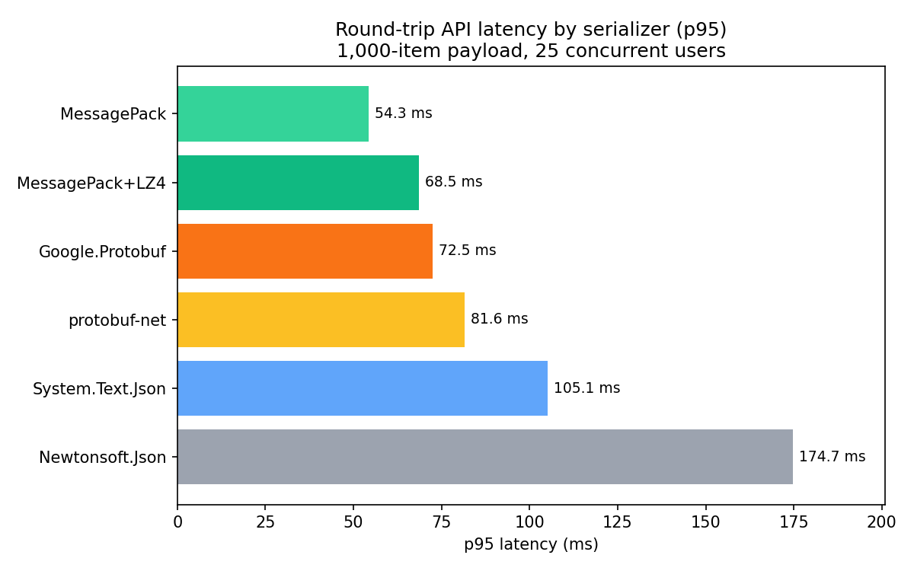
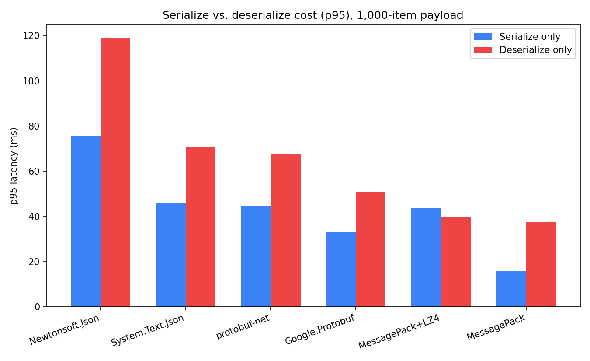
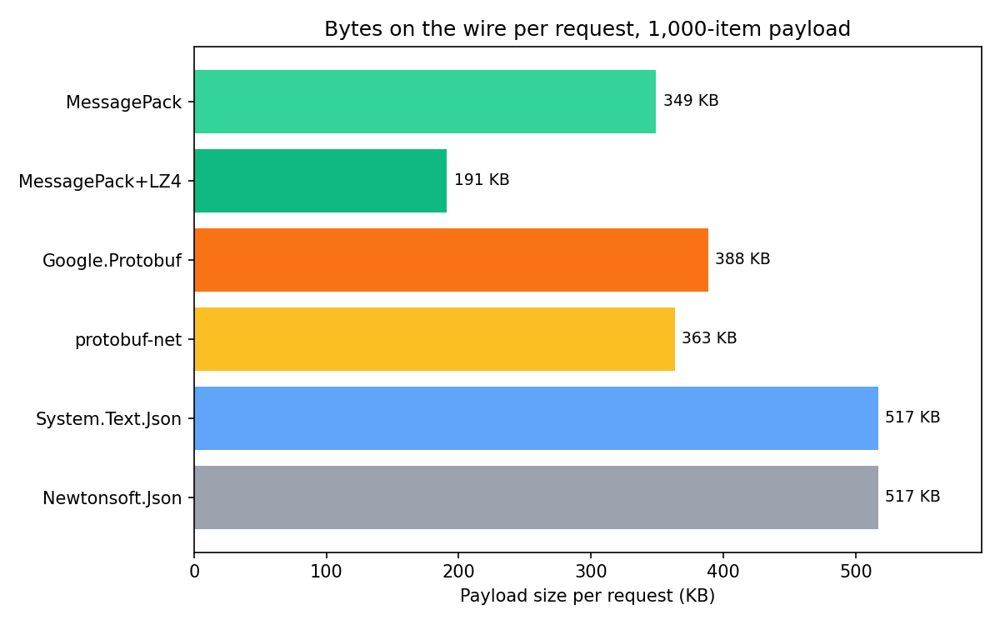
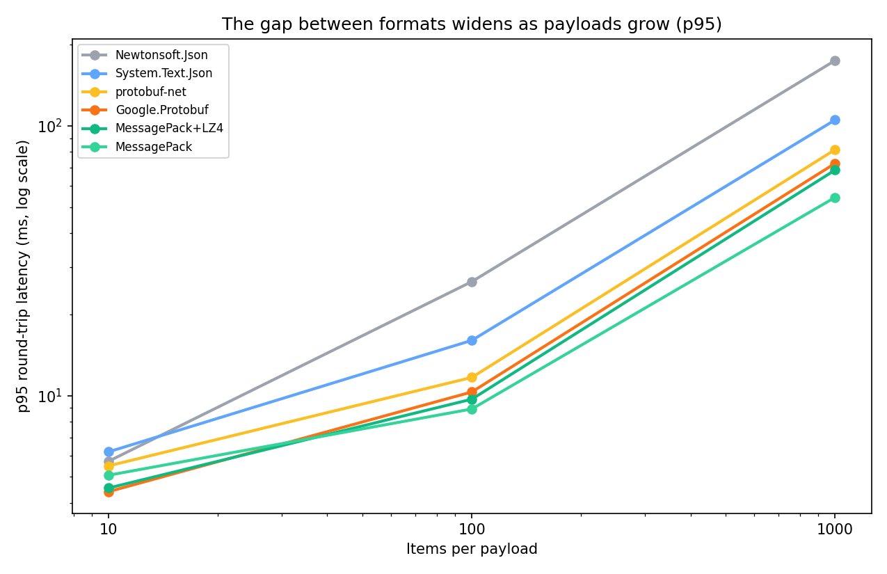

# The Serialization Tax: What JSON, MessagePack, and Protobuf Actually Cost Your .NET APIs

Every request your API handles pays a toll twice — once to turn a C# object into bytes, once to turn those bytes back into a C# object on the other end. Most of the time nobody notices, because `JsonSerializer.Serialize()` is fast enough that it disappears into the noise of a single request. Multiply that toll by a few hundred internal service calls a second, though, and it stops being invisible. It shows up as CPU you're paying for, latency your users feel, and bandwidth on a bill somebody eventually asks about.

We wanted real numbers instead of vibes, so we put six serializers behind an actual ASP.NET Core API, loaded it with k6, and measured what each one costs when it's doing its job under real concurrent traffic rather than sitting alone in a loop.

## The lineup

- **System.Text.Json** — the built-in default and the format most of us reach for without thinking twice.
- **Newtonsoft.Json** — still living in plenty of older services. Included because "we've always used it" isn't the same as "it's still the right call."
- **MessagePack** — binary, compact, and about as close to a drop-in replacement for JSON as you'll find.
- **MessagePack + LZ4** — MessagePack with block compression turned on, trading CPU cycles for a smaller payload.
- **protobuf-net** — Protobuf's wire format, usable directly against plain C# classes without a `.proto` file.
- **Google.Protobuf** — the canonical, schema-first Protobuf implementation, generated from a `.proto` contract.

Same DTO shape across the board — scalars, two string collections, a nested address object — tested at 10, 100, and 1,000 items per payload so we could see whether the story holds up as things scale.

## How we tested it

Six formats, each behind its own endpoint on the same minimal API, running in Docker capped at 2 CPU / 512 MB — a deliberately modest box, closer to a cost-conscious container than a beefy dedicated server. k6 drove 25 concurrent virtual users at each endpoint for 30 seconds, across three scenarios:

- **serialize-only** — server already holds the data in memory, just serializes and responds (isolates pure serialize + transfer cost)
- **deserialize-only** — client posts the payload, server deserializes and returns a one-line ack (isolates pure deserialize cost)
- **round-trip** — deserialize the request, reserialize it, respond — the shape of an actual service-to-service call

One detail worth flagging for anyone reproducing this: we run with `discardResponseBodies: true` in the k6 script, which tells k6 not to buffer response bodies in memory. Without it, a large payload at high concurrency has k6 itself burning CPU and memory just holding onto response data it doesn't need — which pollutes exactly the number you're trying to measure. With it off, you're measuring your API. With it on by mistake, you're partly measuring your load testing tool.

## The numbers

A quick note before the numbers: everything below is **p95 latency**, not average. Average gets pulled down by the mass of fast requests in a run and quietly hides the slower ones — and the slower ones are exactly what a real user notices. p95 tells you what the slowest-but-still-typical 5% of your traffic experiences, which is a much more honest number to make a decision on than a mean that a few GC pauses and connection stalls can flatter.

At 1,000 items, round-trip — deserialize the request, reserialize it, send it back, under 25 concurrent users:

| Format | p95 latency | Throughput |
|---|---|---|
| MessagePack | 54.3 ms | 692 req/s |
| MessagePack + LZ4 | 68.5 ms | 532 req/s |
| Google.Protobuf | 72.5 ms | 442 req/s |
| protobuf-net | 81.6 ms | 396 req/s |
| System.Text.Json | 105.1 ms | 317 req/s |
| Newtonsoft.Json | 174.7 ms | 189 req/s |

MessagePack more than doubles System.Text.Json's throughput at this payload size, and Newtonsoft.Json trails everything else by a wide margin — a pattern that held at every payload size we tested, not just this one.

### Serialize and deserialize aren't the same cost

If your service is mostly writing (serializing a response) or mostly reading (deserializing a request), the combined round-trip number can hide what actually matters to you:

Deserialization costs more than serialization for most formats here — parsing untrusted bytes into objects is fundamentally more work than walking objects you already control. MessagePack+LZ4 is the one exception worth noting: its p95 serialize cost (43.7 ms) actually runs slightly higher than its deserialize cost (39.7 ms), the only format where that ordering flips. The compression step happens on the write side, so that's exactly where you'd expect the extra cost to show up. Worth knowing either way if you're optimizing a read-heavy ingestion endpoint versus a write-heavy reporting one; the format that helps you most can depend on which side of that line your service sits on.

### It's not just speed — it's bytes

MessagePack+LZ4 cuts the wire size roughly in half compared to plain MessagePack, and to under 40% of what JSON sends for the same data. That matters even when latency isn't your bottleneck — bandwidth is a real, metered line item for high-volume internal traffic, and a smaller payload is a smaller bill regardless of how fast the CPU work is.

### The gap gets wider, not narrower, as payloads grow

At 10 items, every format is within a couple milliseconds of each other — the serializer barely matters. By 1,000 items, MessagePack's p95 is nearly half of JSON's (54.3 ms vs. 105.1 ms), and that gap keeps widening as payload size increases. If your services mostly exchange small objects, don't expect this to be your biggest lever. If you're moving lists, batches, or anything with real size to it, this is exactly where the choice starts to matter.

## The raw numbers, measured in isolation

Everything above happened behind an HTTP endpoint, under concurrent load, in a resource-capped container — which is the environment your API actually runs in, but it's not the cleanest way to isolate what a serializer costs on its own. For that, we also ran each format through BenchmarkDotNet: single-threaded, no network, no other requests competing for the box. Useful if you're doing capacity planning or just want the CPU/memory number with nothing else in the picture. (These numbers are the mean across iterations rather than p95 — with no network and no concurrent load to introduce a tail, there isn't much of one to measure; the API numbers above are where percentile choice actually matters.)

**CPU time and memory allocated, 1,000-item payload:**

| Format | Serialize | Deserialize | Allocated (serialize) |
|---|---|---|---|
| MessagePack | 252 µs | 544 µs | 189 KB |
| MessagePack + LZ4 | 319 µs | 789 µs | 48 KB |
| Google.Protobuf | 377 µs | 486 µs | 230 KB |
| protobuf-net | 579 µs | 794 µs | 803 KB |
| System.Text.Json | 1,033 µs | 1,407 µs | 384 KB |
| Newtonsoft.Json | 1,735 µs | 2,515 µs | 1,776 KB |

Same overall shape as the API numbers — MessagePack cheapest, Newtonsoft most expensive by a wide margin — but the details are worth a look. protobuf-net allocates more memory here than any format except Newtonsoft, despite being reasonably quick on CPU time. And LZ4's deserialize cost is 45% higher than plain MessagePack's when nothing else is competing for the CPU, a clean, uncontested look at exactly the compression tax mentioned above.

**Serialized payload size, no HTTP overhead, at each scale:**

| Format | 10 items | 100 items | 1,000 items |
|---|---|---|---|
| MessagePack | 1.80 KB | 18.13 KB | 184.84 KB |
| MessagePack + LZ4 | 0.63 KB | 4.78 KB | 47.70 KB |
| System.Text.Json | 3.69 KB | 37.10 KB | 373.87 KB |
| Newtonsoft.Json | 3.69 KB | 37.10 KB | 373.87 KB |
| protobuf-net | 1.91 KB | 19.30 KB | 195.83 KB |
| Google.Protobuf | 2.20 KB | 22.13 KB | 224.15 KB |

This is the cleanest bandwidth comparison we have — just bytes on disk, no HTTP headers or transport overhead mixed in. MessagePack+LZ4 lands at roughly an eighth of JSON's size at every scale we tested, which is the actual number to plug into a bandwidth-cost calculation if you're building the case internally.

## Where MessagePack+LZ4 needs an asterisk

MessagePack+LZ4 looks like the obvious second choice after plain MessagePack — smaller payload, still fast. Worth being straight about the catch: compression only pays for itself if your data actually compresses. Our test payload has a fair amount of built-in repetition — a small fixed set of tag and category strings reused across every item — which is close to a best case for LZ4. Real production data — free-text fields, GUIDs, unique identifiers, user-generated content — often compresses far less predictably.

The CPU cost of compression, on the other hand, is fairly stable regardless of how well the data compresses — you're paying that tax whether or not you get the payload-size win back. So treat LZ4 as something to test against your own real data and your own traffic shape, not as an automatic upgrade over plain MessagePack. When it works, it's genuinely excellent. When your data doesn't cooperate, you're just paying extra CPU for very little in return.

## Where we landed

- **System.Text.Json stays the default for anything public-facing.** The performance gap only matters at real scale, and losing easy debuggability for a win nobody outside your team benefits from is a bad trade for a public contract.
- **MessagePack is the strongest all-around upgrade for internal service-to-service calls.** It won every scenario we tested, at every payload size, without needing a schema or any real migration ceremony.
- **MessagePack+LZ4 is worth testing, not defaulting to.** Profile it against your actual data before committing — the win is real when your data compresses, and disappointing when it doesn't.
- **Protobuf (either flavor) earns its place when you need a versioned, cross-language contract** — polyglot systems, external partner integrations — independent of exactly where it lands on a speed chart.
- **Newtonsoft.Json is the one result we're comfortable calling settled.** It lost every comparison, at every payload size, usually by a wide margin. If it's sitting in a hot path purely out of habit, that's a low-risk, high-value cleanup.

## A couple of things to watch for

- **You lose casual debuggability with any binary format.** You can't eyeball a MessagePack or Protobuf payload in a browser's network tab the way you can with JSON. A small CLI that dumps a binary payload back to readable JSON for local debugging pays for itself fast.
- **Protobuf needs real schema discipline.** Field numbers are permanent once shipped — reusing or renumbering them silently breaks wire compatibility in ways that won't surface until something in production starts failing to deserialize.
- **Test with your own data before you trust anyone else's numbers — including these.** Payload shape changes everything, especially for compression. A benchmark fixture is never quite your production traffic.

## The short version

JSON is still the right default for anything public. For internal, high-volume service calls, MessagePack is the clear, low-risk win — fast, compact, and close to zero migration friction. LZ4 compression can take you further still, but it's a bet on your specific data, not a free upgrade, so test it before you ship it.
